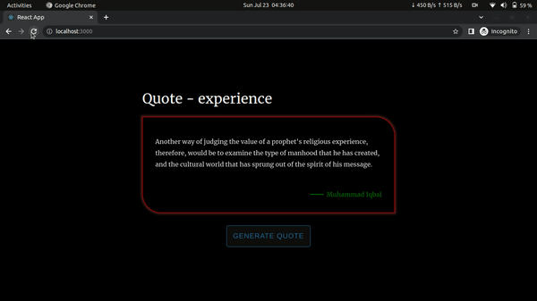
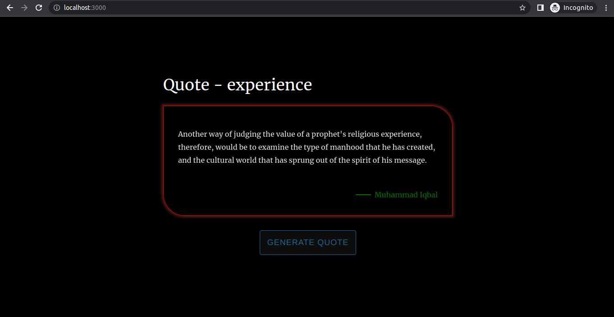
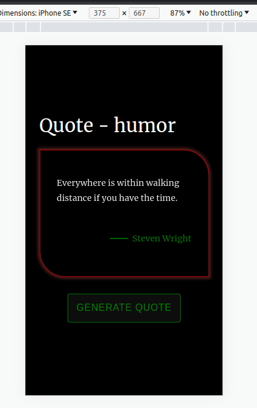

# Quotes Generator

<br />
<br />

<div style="text-align:center"></div>

<br />
<br />

## Prerequisites

```sh
React version = 18.2.0
Node version = 16.19.0
Npm version = 8.19.3
Yarn version = 1.22.19
```

## Development server

```sh
yarn start
```

Run `yarn start` for a dev server. Navigate to `http://localhost:3000/`. The application will automatically reload if you change any of the source files.

Verify the deployment by navigating to your server address in your preferred browser.

```sh
http://localhost:3000
```

## Build

```sh
yarn build
```

Run `yarn build` to build the project. The build artifacts will be stored in the `build/` directory.

<br />
<br />

## Screenshot

<div style="text-align:center"></div>

<br />
<br />

<div style="text-align:center"></div>
<br />
<br />

## License

MIT
